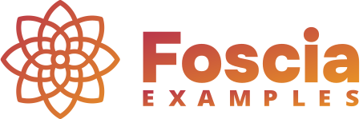

  

<a href="https://foscia.dev">
  Website
</a>
•
<a href="https://foscia.dev/docs/getting-started">
  Documentation
</a>

This repository holds ready-to-run examples of projects using Foscia. Most
examples are using Docker, allowing you to get started quickly.

You can also check out the [Foscia playground](https://foscia.dev/playground)
to get an in-browser ready-to-run example.

## REST

| Directory                                                | Description                                      |
|----------------------------------------------------------|--------------------------------------------------|
| [`rest/laravel-vuetify`](rest/laravel-vuetify/README.md) | A Vue+Vuetify frontend using a Laravel REST API. |
